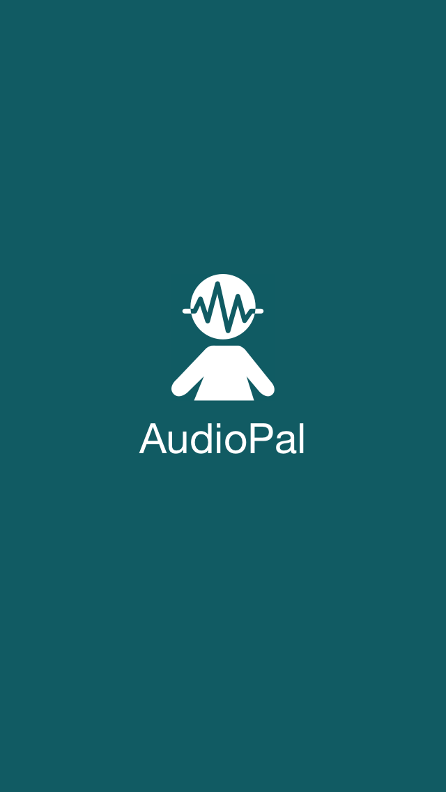
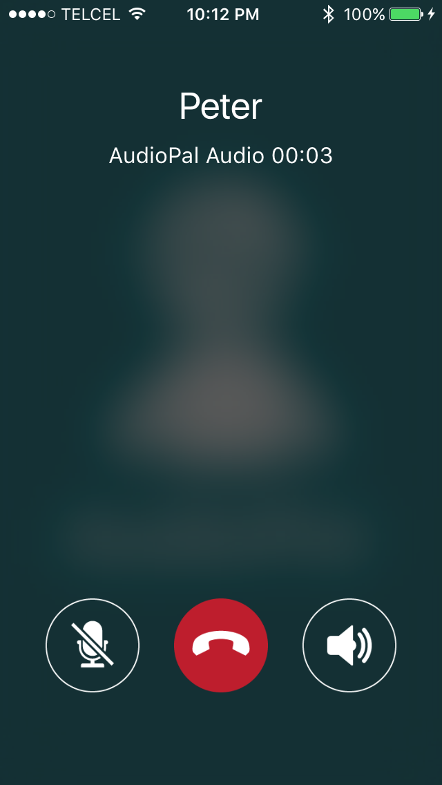

# AudioPal

iOS App to communicate with nearby people. It makes audio calls without necessity of internet nor router.  

The project is written mostly in Swift 3, with some few parts in Objective-C and C++. The near device detection is made with Bonjour and the audio processing with AudioToolbox. The audio stream is transmitted over NetService and is conformed by samples using AAC-ELD encoding.  

Since the Bonjour service is published, resolved and monitored over peer-to-peer, the application is able to connect to other devices using Wi-Fi and/or Bluetooth even if the devices are not connected to the same network.  

The only requirement is to have iOS 10.0 or superior installed.  

The project is non-profit, it was developed with the motivation to learn and practive more iOS development, so feel free to contribute in any way.

## Screenshots

